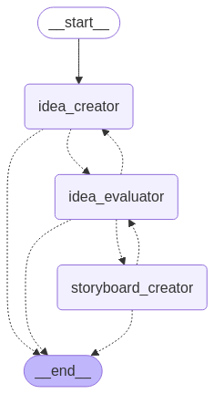

# Creative Agent 创意代理

基于LangGraph的创意代理工作流，帮助用户生成和管理创意内容。

## 项目简介

Creative Agent是一个利用LangGraph构建的创意工作流管理工具，可以辅助创意生成、优化和执行过程。



## 安装方法

### 依赖条件
- Python >= 3.11

### 安装步骤

1. 进入项目根目录
```bash
cd creative-agent
```

2. 安装依赖
```bash
pip install -e .
#or
pip install -r requirements.txt
```

3. 环境配置
复制`.env.example`文件并重命名为`.env`，然后配置你的API密钥：
```bash
cp .env.example .env
# 编辑.env文件，添加你的OpenAI API密钥
```

## 使用方法

```bash
langgraph dev
```

## 项目结构

```
creative-agent/
├── create_agent/          # 核心代理代码
│   ├── agent.py           # 代理定义
│   └── utils/             # 工具函数
├── .env.example           # 环境变量示例
└── pyproject.toml         # 项目配置
```